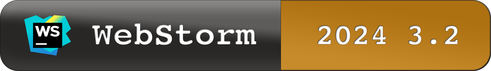

  <h1>WEB - Portfolio</h1>
  

   

## Описание

*Этот проект представляет собой веб-портфолио, демонстрирующее мои навыки и выполненные работы в области веб-разработки.*

- **Отображены выполненные проекты: каждое из которых имеет ссылки, небольшое описание и функциональные примеры.**
- **Ссылки на социальные сети.**
- **Демонстрация "О себе."**
- **Небольшие анимации"**

Проект был разработан с нуля мной лично. Макеты были созданы в [Figma](https://ru.wikipedia.org/wiki/Figma). Реализация и верстка выполнены с использованием [HTML](https://ru.wikipedia.org/wiki/HTML), [CSS](https://ru.wikipedia.org/wiki/CSS) и [JavaScript](https://ru.wikipedia.org/wiki/JavaScript).

Этот сайт — не просто портфолио, а моя профессиональная визитка в сети, которая отражает не только мои навыки, но и подход к каждой задаче. Я надеюсь, что он будет вдохновлять на новые проекты и сотрудничество.

# Demo-version 
[Demo-version](https://github.com/user-attachments/assets/ee3d20bb-003d-4239-b60e-c1a3da054100)

<video width="640" height="360" controls>
  <source src="https://github.com/user-attachments/assets/ee3d20bb-003d-4239-b60e-c1a3da054100" type="video/mp4">
  Your browser does not support the video tag.
</video>

## В планах разработки

- **Кроссбраузерная совместимость:** улучшение поддержки различных браузеров для стабильной работы и визуальной идентичности на всех устройствах.
- **Усовершенствование анимаций:** добавление более плавных и интересных анимаций для улучшения взаимодействия с пользователем.
- **Оптимизация UI-интерфейса:** дальнейшее улучшение дизайна и функциональности интерфейса для повышения удобства и доступности.
- **Адаптация под все устройства:** расширение адаптивности, чтобы сайт корректно отображался на всех экранах — от мобильных устройств до десктопов.
- **Развертывание с использованием Flask:** настройка удалённого доступа и развертывание проекта с использованием фреймворка Flask для упрощённого взаимодействия с сервером и демонстрации сайта в реальном времени.
